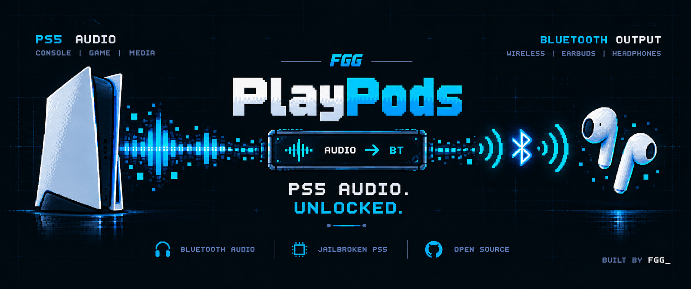

<p align="center">
  
</p>

<h1 align="center">FGG-PlayPods</h1>

<p align="center">
  <b>Hear your PlayStation 5 on an ordinary Bluetooth headset.</b><br>
  Game audio and system sounds, through the console's own Bluetooth — no dongle,<br>
  and your DualSense stays wireless.
</p>

<p align="center">
  <a href="https://github.com/FGGstore/FGG-PlayPods/actions/workflows/ci.yml"></a>
  <a href="LICENSE"></a>
  
</p>

---

The PS5 has Bluetooth, but no Bluetooth audio. Its radio talks to controllers
and nothing else, and Sony's own wireless headsets need a USB dongle.

FGG-PlayPods changes that. It captures everything the console plays and
streams it to your headset over the PS5's own Bluetooth chip.

```
  PS5 audio ──capture──► FGG-PlayPods ──A2DP over the PS5's own Bluetooth──► headset
```

|                        |                                                             |
|------------------------|-------------------------------------------------------------|
| **What you hear**      | games, menus, notifications — everything the console plays  |
| **Headsets**           | any Bluetooth headphones, headset or earbuds (A2DP / SBC)  |
| **Audio**              | 48 kHz stereo, SBC at high quality (bitpool 53)             |
| **Your DualSense**     | stays wireless and fully working                            |
| **Installed?**         | nothing — no patches, no files outside its own folder       |

## Install

Grab `fgg-playpods.elf` from the [latest release](https://github.com/FGGstore/FGG-PlayPods/releases/latest).

**With Payload Manager** — copy `fgg-playpods.elf` and `fgg-playpods.elf.json`
over FTP into:

```
/data/pldmgr/payloads/fgg-playpods/
```

then launch **fgg playpods** from the Payload Manager page.

**Without it** — send `fgg-playpods.elf` to port **9021** with any payload sender.

## Use

1. **First time:** put the headset in **pairing mode**, then launch the
   payload. It finds the headset, pairs and starts playing.
2. **Every time after:** switch the headset on and launch. It reconnects to
   the headset it paired with.
3. **To stop:** switch the headset off.

Switching games gives a second or two of silence while the next one starts;
the sound comes back by itself.

---

## The engineering story

Nothing here was documented. Every piece was worked out on a real console,
often by being wrong first. These are the problems in the order they were
met, and how each one was solved.

### 1. Does the PS5 really have no Bluetooth audio?

It is easy to assume the feature is just hidden. So the console's system
software was decrypted and searched: `SceShellCore`, `SceSysCore`, the
ShellUI and every system library. There is no A2DP, AVDTP, AVRCP or SBC
anywhere. The only Bluetooth the system knows is HID — controllers — and its
own headsets (Pulse, PS VR2) arrive through a USB dongle as USB audio.

**So the whole Bluetooth audio stack had to be written from scratch:** SSP
pairing, L2CAP, SDP, AVDTP and SBC-encoded RTP audio — a complete A2DP source
running inside a payload.

### 2. Capturing the console's sound

The capture service (`av_capture_manager`) is what feeds recording,
broadcasting and Remote Play. Its client library, `libSceAvcap2`, has no
public API. Its functions were identified by decrypting the library, matching
its exported NIDs against candidate names, and reading the disassembly.

- **The first call killed the payload without a trace** — no crash, no log
  line. The library depends on `libSceIpmi`, which a payload's process does
  not have loaded, and an unresolved import on the PS5 ends the process
  outright. **Fix:** load `libSceIpmi` first.
- **The capture returned "errors" that were not errors.** The disassembly of
  the ring-buffer reader showed that `0x81950002` means *nothing to read yet*
  and `0x81950004` means *you fell behind and were moved to live audio*.
  **Fix:** treat both as normal conditions.
- **The audio format was unknown.** 10 seconds were recorded to a file and
  analysed on a PC: 48 kHz, stereo, 32-bit float, 1024 frames per record.
- **No system sounds, and silence whenever the PS menu was open.** That is the
  *recording* mix: it mutes the system UI on purpose. Remote Play clearly
  hears everything, so its server was disassembled to see how *it* asks.
  **Fix:** one field in the request — Remote Play's audio source — gives the
  full mix: game and system, never muted.
- **Switching games ended the capture.** The service ends a session when the
  game closes and refuses a new one until the next game is running.
  **Fix:** keep the headset fed with silence and restart the capture every
  half second until it comes back.

### 3. Finding a Bluetooth controller to use

The first working version took over the console's Bluetooth chip entirely —
and the DualSense went dead with it, because it lives on the same chip.

Reading the chip's USB descriptors showed something unusual: **it is two
complete Bluetooth controllers in one device**, each with its own address.
Probing them showed the system runs the DualSense on the second one; the
first carries no traffic.

Taking only the first one still killed the DualSense. Detaching the system's
driver step by step pinned it down: removing the driver from **any single
interface** of the chip — even the first controller's audio-only one — brings
the whole system Bluetooth stack down.

**Fix:** don't take the controller at all. **Share it.** The payload opens
the first controller's endpoints right next to the system's driver, which
stays attached and never notices.

### 4. Sharing a controller with a driver that doesn't know you're there

Sharing works, but the system's driver keeps its own reads pending on the
same endpoints. Every packet from the chip goes to whichever read is first
in line — so with one read, **half of everything was lost** to the system.

- **Many pending reads win most of the packets:** 1 read got 50%, 4 got 80%,
  15 got 90%, 48 get about 98%. The kernel limits how many can be pending, so
  event reads use small buffers to fit as many as possible.
- **Everything that can be asked again is asked again:** HCI commands,
  AVDTP signals and L2CAP configuration are repeated if the answer went to
  the system instead.
- **Lost delivery reports must not stall the stream.** The chip reports each
  packet it has sent; about one report in fifty goes to the system. A packet
  not reported within 60 ms is taken as sent — the radio normally sends one
  in far less.
- **Never touch what isn't ours.** The DualSense uses this controller when it
  reconnects. Early versions answered its connection and pairing requests —
  and broke it. Now only events about the headset are acted on; everything
  else is left for the system to answer.

### 5. The things that didn't work

A few fixes looked right on paper and made things worse on the console.
They are worth recording:

- **An automatic flush timeout** (drop audio packets the radio can't send in
  time) made this chip report sent packets far later, which starved the
  stream.
- **Adaptive bitrate** — lowering SBC quality when the radio is busy — made
  the packet rate collapse right after the first quality change, every time.
- **Strict flow control**, waiting for every delivery report before reusing
  a buffer, ran at about two-thirds of the speed the audio needs.

The stream that works is the simple one: full quality, fixed settings,
packets paced by the audio clock, and the 60 ms rule above. Every run was
measured from its logs — packets per second, reports lost, queue depth —
and the final design holds a steady **75 packets per second for 40+ minutes
with nothing dropped**.

### 6. Small details that cost the most time

- On this chip, ACL data goes to bulk endpoint `0x01`; bytes written to
  `0x02` are parsed as HCI **commands**.
- A headset that reconnects by itself also starts encryption by itself —
  asking at the same moment collides, so the payload waits for it first.
- A link left open by an earlier session makes the next connection fail with
  *connection already exists*; handles on a shared controller may belong to
  the system, so nothing is ever disconnected blindly.

---

## Headsets

Anything that plays music from a phone over Bluetooth should work.
FGG-PlayPods speaks **A2DP with SBC**, the profile and codec every Bluetooth
headphone is required to support. It streams at 48 kHz when the headset
allows it and at 44.1 kHz otherwise.

Developed and verified with an Xbox Wireless Headset on firmware **11.60**.

**Limits:**

- **One headset at a time.** To pair a different one, delete
  `/data/fgg-playpods/headset.key` over FTP and launch with the new headset in
  pairing mode.
- **Sound only** — no microphone.
- **Volume** is set on the headset; the console's slider doesn't reach it.
- **Latency** is that of Bluetooth audio with SBC: fine for most games,
  noticeable in rhythm games.
- **LE Audio-only earbuds** are not supported; almost every headset also
  speaks classic Bluetooth, which is what is used.

## Building

Needs Linux or WSL and the
[PS5 Payload SDK](https://github.com/ps5-payload-dev/sdk):

```sh
sudo apt install clang lld llvm make unzip    # llvm is required, and easy to miss
export PS5_PAYLOAD_SDK=/opt/ps5-payload-sdk
make
```

Builds at `-Wall -Wextra -Werror`. The only third-party code is BlueZ's SBC
codec, vendored in [`third_party/sbc`](third_party/sbc/VENDORED.md).

| File            | What it does                                                   |
|-----------------|----------------------------------------------------------------|
| `src/capture.c` | the console's audio, requested the way Remote Play asks for it |
| `src/hci.c`     | USB transport to the shared Bluetooth controller               |
| `src/bt.c`      | pairing, the link to the headset, L2CAP, flow control          |
| `src/sdp.c`     | the service record a headset looks up                          |
| `src/a2dp.c`    | AVDTP setup, SBC encoding and the stream itself                |
| `src/main.c`    | the single-instance lock and the session                       |

## Troubleshooting

Every session is logged to `/data/fgg-playpods/playpods.log`; fetch it over
FTP to see what happened.

**"searching - put the headset in pairing mode" and nothing happens.** The
headset isn't in pairing mode, or is connected to a phone. Disconnect it from
other devices and try again.

**"turn the headset off and on".** A link from an earlier session is still
open on the headset's side. Switching the headset off clears it.

**"could not connect to the headset".** The headset is off, out of range, or
connected to another device. If it was re-paired elsewhere, delete
`headset.key` and pair again.

**"already running".** A copy is already playing. Switch the headset off to
stop it.

**Sound and DualSense stop together.** In long testing this happened once:
the Bluetooth chip reported an internal error, and both of its controllers
stopped. Restart the console. The log records the chip's report — please
include it if you open an issue.

## Licence

[GPL-3.0](LICENSE). The vendored SBC codec is LGPL-2.1-or-later.

## Credits

Built by **FGG STORE**.

Standing on the work of [ps5-payload-dev](https://github.com/ps5-payload-dev)
for the SDK and `ftpsrv`, of [BlueZ](https://www.bluez.org/) for the SBC codec,
and of [idlesauce/ps5-self-pager](https://github.com/idlesauce/ps5-self-pager),
which made reading the system software possible.

> Not affiliated with Sony Interactive Entertainment or Microsoft. For use with
> homebrew on consoles you own.
